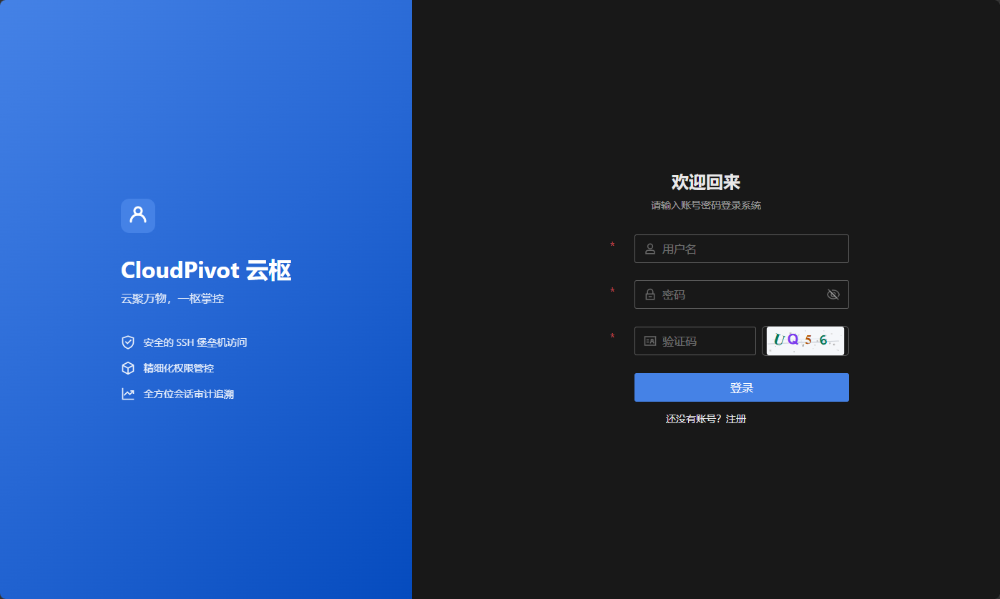
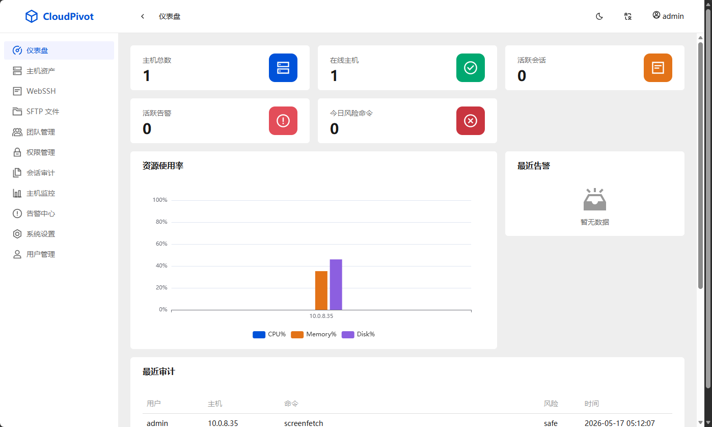
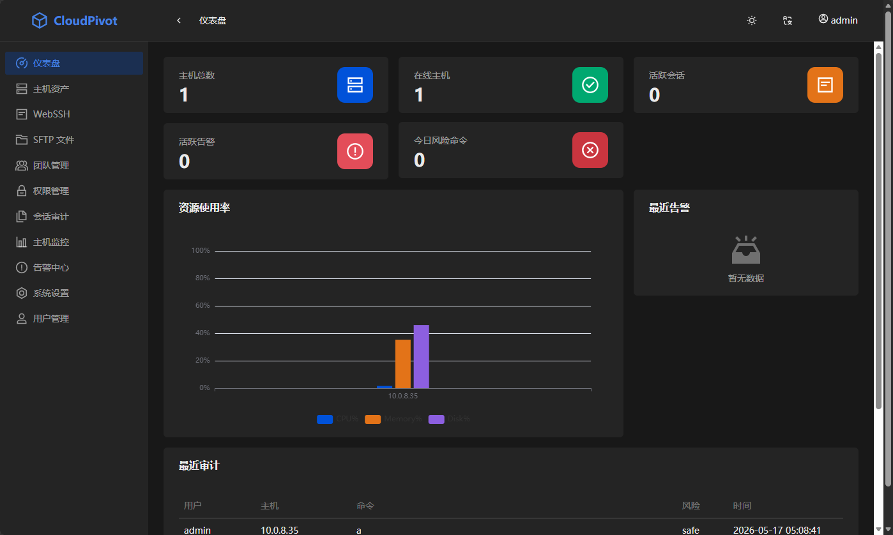
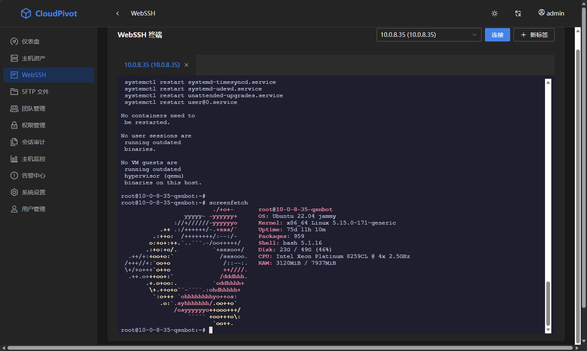
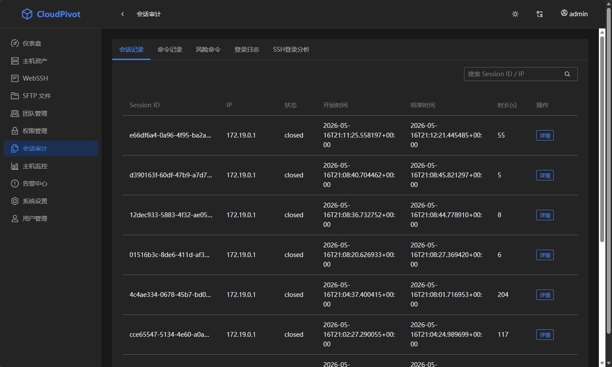
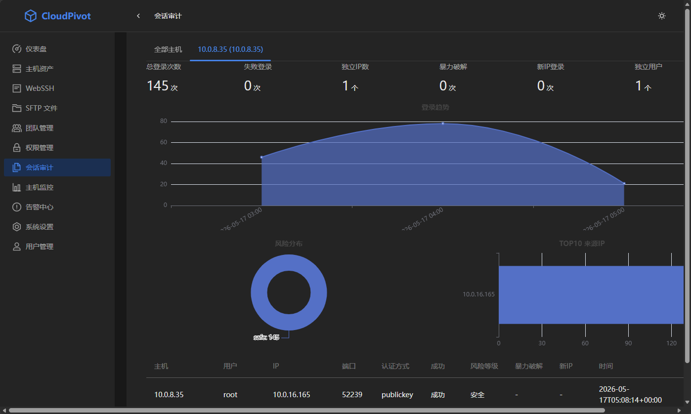
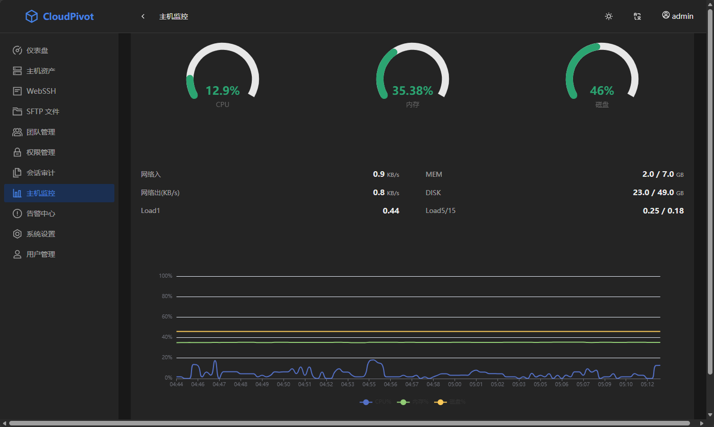
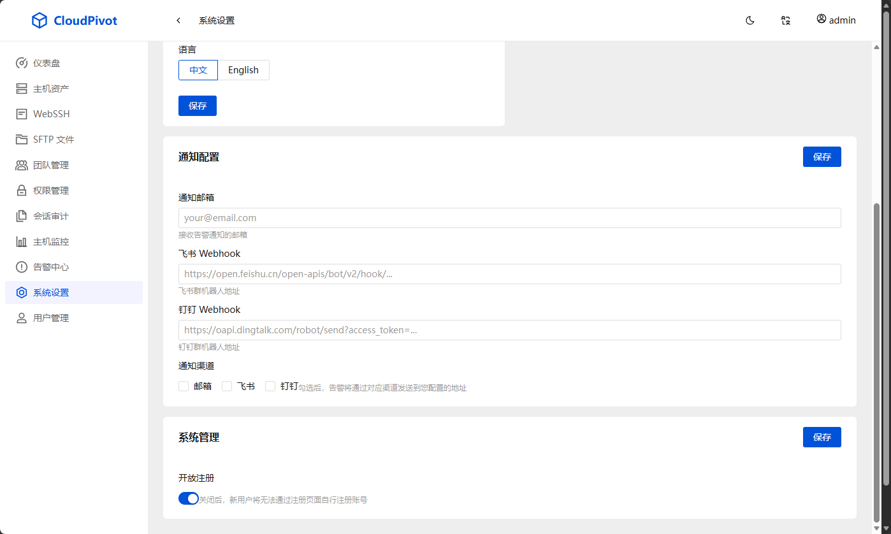

# CloudPivot 云枢

> 云聚万物，一枢掌控

CloudPivot 是一个现代化、云原生、轻量级的 SSH 运维堡垒机平台，提供安全可靠的运维访问控制、会话审计、主机监控与 Docker 管理能力。


















## 技术栈

### 后端
- **FastAPI** - 高性能异步 Python Web 框架
- **SQLAlchemy 2.0** - 异步 ORM
- **Alembic** - 数据库迁移
- **asyncssh** - 异步 SSH 客户端
- **PostgreSQL** - 主数据库
- **Redis** - 缓存与消息队列
- **aiodocker** - 异步 Docker 客户端

### 前端
- **Vue 3** + TypeScript
- **TDesign Vue Next** - 企业级 UI 组件库
- **Pinia** - 状态管理
- **Vue I18n** - 国际化（中/英）
- **xterm.js** - Web 终端
- **ECharts** - 图表可视化

## 核心功能

| 模块 | 功能 |
|------|------|
| 用户与团队 | 注册登录、团队 RBAC 管理、团队数据隔离、登录日志 |
| 主机资产 | SSH 主机 CRUD、分组标签、连通性检测、密码/密钥认证、批量导入 |
| WebSSH | 多标签终端、分屏、自动重连、文件上传、xterm.js + WebSocket |
| 权限控制 | 用户/团队至主机授权、临时授权与过期、细粒度(只读/上传/执行)、时间限制 |
| 会话审计 | 操作录屏回放、命令审计、风险命令检测(rm -rf 等)与拦截、导出 |
| 主机监控 | Agent 采集 CPU/内存/磁盘/网络、实时图表、告警规则 |
| Docker 管理 | 容器生命周期、日志/Stats/Exec、镜像管理 |
| Dashboard | 全局概览、资源使用率、风险告警、最近审计 |
| 告警系统 | 资源超限、异常登录、离线告警，邮件/飞书/钉钉/Webhook 通知 |

## 项目结构

```
CloudPivot-Server/
├── main.py                     # FastAPI 入口
├── requirements.txt            # Python 依赖
├── alembic.ini                 # Alembic 配置
├── alembic/                    # 数据库迁移
├── Dockerfile                  # Docker 构建
├── docker-compose.yml          # Docker Compose 编排
├── .env.example                # 环境变量模板
├── app/
│   ├── config.py               # 全局配置
│   ├── database.py             # 数据库连接
│   ├── dependencies.py         # 依赖注入（认证）
│   ├── core/
│   │   ├── security.py         # JWT & 密码加密
│   │   ├── ssh.py              # SSH 连接池
│   │   ├── websocket.py        # WebSocket 管理器
│   │   ├── docker_client.py    # Docker 客户端封装
│   │   └── logger.py           # 日志配置
│   ├── models/                 # SQLAlchemy 数据模型
│   │   ├── user.py, team.py, host.py
│   │   ├── permission.py, session.py
│   │   ├── monitor.py, docker.py, log.py
│   ├── schemas/                # Pydantic 请求/响应模型
│   ├── routers/                # API 路由
│   │   ├── auth.py, team.py, host.py
│   │   ├── webssh.py, permission.py
│   │   ├── dashboard.py, monitor.py
│   │   ├── docker.py, audit.py
│   └── services/
│       └── notification.py      # 多渠道通知服务
├── cloudpivot-web/             # 前端项目
│   ├── src/
│   │   ├── views/              # 页面视图
│   │   ├── layouts/            # 布局组件
│   │   ├── api/                # API 请求封装
│   │   ├── stores/             # Pinia 状态管理
│   │   ├── router/             # 路由配置
│   │   └── locales/            # 国际化文件 (zh-CN / en)
│   ├── Dockerfile
│   └── nginx.conf
└── routers/                    # 原有辅助路由
```

## 快速开始

### 前置条件
- Python 3.12+
- Node.js 20+
- PostgreSQL 16+
- Redis 7+

### 1. 克隆项目

```bash
git clone https://github.com/your-org/CloudPivot-Server.git
cd CloudPivot-Server
```

### 2. 后端启动

```bash
# 创建虚拟环境
python -m venv venv
source venv/bin/activate  # Windows: venv\Scripts\activate

# 安装依赖
pip install -r requirements.txt

# 复制环境变量
cp .env.example .env
# 编辑 .env 配置数据库等

# 初始化数据库（开发模式自动建表）
python -m uvicorn main:app --reload --host 0.0.0.0 --port 8000
```

### 3. 前端启动

```bash
cd cloudpivot-web

# 安装依赖
npm install

# 开发模式
npm run dev

# 生产构建
npm run build
```

### 4. Docker 部署（推荐）

```bash
# 一键启动所有服务
docker-compose up -d

# 查看日志
docker-compose logs -f backend

# 初始化数据库
docker-compose exec backend alembic upgrade head
```

### 5. 数据库迁移

```bash
# 创建迁移
alembic revision --autogenerate -m "init tables"

# 执行迁移
alembic upgrade head
```

## API 文档

启动后访问：
- Swagger UI: `http://localhost:8000/docs`
- ReDoc: `http://localhost:8000/redoc`

## 环境变量

| 变量名 | 说明 | 默认值 |
|--------|------|--------|
| `APP_SECRET_KEY` | 应用密钥 | change-me |
| `APP_ACCESS_TOKEN_EXPIRE_MINUTES` | Token 过期时间(分钟) | 480 |
| `DATABASE_URL` | PostgreSQL 连接串 | postgresql+asyncpg://... |
| `REDIS_URL` | Redis 连接串 | redis://localhost:6379/0 |
| `DOCKER_HOST` | Docker Socket | unix:///var/run/docker.sock |
| `SMTP_HOST` | 邮件服务器 | - |
| `LOG_LEVEL` | 日志级别 | INFO |

## 默认账号

首次运行后通过 `/api/v1/auth/register` 注册管理员账号。

内置管理员账号：`admin` / `admin123`
## License

MIT License
